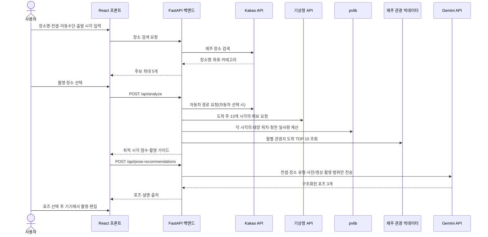

# scene-Jeju 기술 구현 상세 및 심사위원 질문 대응

이 문서는 `scene-Jeju` 해커톤 MVP의 실제 구현을 기준으로 작성한 발표·질의응답용 기술 문서입니다. 구현하지 않은 기능을 구현했다고 표현하지 않으며, 외부 데이터·계산값·휴리스틱·생성형 AI 결과를 구분합니다.

## 1. 서비스 한 문장 정의

사용자가 **지금 출발했을 때가 아니라 실제 촬영 장소에 도착했을 때**의 날씨와 빛을 계산하고, 선택한 촬영 컨셉에 가장 잘 맞는 시간·촬영 위치·포즈·촬영 방법을 알려주는 제주 촬영 지원 서비스입니다.

핵심 차별점은 관광지 자체를 추천하는 데서 끝나지 않고 다음 결과물까지 연결한다는 점입니다.

1. 장소명으로 좌표를 찾습니다.
2. 출발 위치와 이동수단으로 도착 예상 시각을 계산합니다.
3. 도착 시각부터 12시간 뒤까지 날씨와 빛을 비교합니다.
4. 가장 적합한 시각과 촬영 방향을 쉬운 문장으로 설명합니다.
5. 컨셉에 맞는 포즈 3개를 추천합니다.
6. 사용자가 포즈 하나를 고르면 반투명 가이드와 함께 직접 촬영합니다.
7. 촬영한 사진·영상을 브라우저 안에서 편집하고 저장합니다.

## 2. 기술 구성과 선택 이유

| 영역 | 사용 기술 | 선택 이유 |
| --- | --- | --- |
| 프론트엔드 | React + TypeScript + Vite | 모바일 입력·지도·카메라·편집처럼 상태가 많은 UI를 컴포넌트로 분리하고, 타입으로 API 응답 오류를 줄이기 위해 사용 |
| 백엔드 | Python + FastAPI + Pydantic | 기상·태양 계산용 Python 라이브러리를 사용하면서 요청·응답 스키마와 자동 API 문서를 함께 제공하기 위해 사용 |
| 태양 계산 | `pvlib` | 위도·경도·시간으로 태양의 겉보기 위치와 맑은 하늘 기준 일사량을 재현 가능한 방식으로 계산하기 위해 사용 |
| 장소·경로 | Kakao Local·Maps·Mobility | 장소명→좌표, 지도 선택, 자동차 경로를 제주 서비스에서 한 흐름으로 연결하기 위해 사용 |
| 기상 | 기상청 초단기예보·단기예보 | 국내 공공 예보의 강수량·바람·하늘상태를 도착 예상 시각에 맞춰 사용하기 위해 선택 |
| 관광 데이터 | 제주 관광 빅데이터 플랫폼 | 월별 인기 관광지 방문 경향을 촬영 시 군중 회피 가이드에 활용하기 위해 사용 |
| 포즈 추천 | Gemini Generate Content API | 컨셉·장소 유형·사진/영상·전신/상반신 조건을 구체적인 몸·손·시선·촬영 거리 문장으로 변환하기 위해 사용 |
| 촬영·편집 | Browser Media APIs | 사진·영상 원본을 서버에 업로드하지 않고 기기 안에서 촬영·편집·저장하기 위해 사용 |

### 왜 Streamlit이 아니라 React와 FastAPI인가?

Streamlit은 데이터 분석 데모를 빠르게 만들기에는 적합하지만, 이 서비스에는 모바일 카메라 스트림, 반투명 포즈 오버레이, 다중 영상 클립 편집, 로컬 저장, 공유, 세밀한 반응형 UI가 필요합니다. React는 이런 브라우저 상호작용을 다루기 쉽고 FastAPI는 기상·태양·점수 계산을 프론트와 분리할 수 있습니다.

따라서 이번 선택은 Streamlit이 나빠서가 아니라 **서비스의 핵심이 단순 결과 표가 아니라 모바일 촬영 경험**이기 때문입니다.

## 3. 전체 데이터 흐름



카메라 영상·사진·얼굴·관절 정보는 위 포즈 추천 요청에 포함되지 않습니다.

## 4. 입력 검증

`POST /api/analyze`의 핵심 입력은 다음과 같습니다.

```json
{
  "current_location": {
    "latitude": 33.5104,
    "longitude": 126.4914
  },
  "place": {
    "name": "함덕해수욕장",
    "latitude": 33.5431,
    "longitude": 126.6692,
    "place_type": "beach"
  },
  "concept_id": "refreshing",
  "capture_mode": "video",
  "transport_mode": "car",
  "departure_time": "2026-08-12T14:00:00+09:00"
}
```

백엔드는 Pydantic으로 다음 조건을 검사합니다.

- 위도·경도의 일반적인 범위를 검사합니다.
- 촬영 장소는 MVP 범위인 제주 경계 `위도 33.05~33.65`, `경도 125.95~127.05` 안이어야 합니다.
- `place_id`와 사용자 입력 `place`는 둘 중 하나만 허용합니다.
- 출발 시각에는 UTC offset이 있어야 합니다.
- 장소 유형은 `beach / forest / urban / indoor` 중 하나여야 합니다.
- 이동수단은 `car / transit / walk`, 촬영 결과는 `photo / video` 중 하나여야 합니다.
- 프론트에서는 출발 시각을 현재부터 48시간 안으로 제한합니다.

## 5. 장소명 입력에서 좌표 확정까지

### 5.1 키워드 검색

프론트가 `GET /api/places/search?query=함덕해수욕장`을 호출하면 백엔드는 검색어에 `제주`가 없을 경우 자동으로 붙이고 Kakao Local 키워드 검색을 호출합니다.

- 최대 10개를 정확도순으로 요청합니다.
- 제주 경계 밖의 결과를 제거합니다.
- 최종 후보는 최대 5개만 반환합니다.
- 장소명, 주소, 위도 `y`, 경도 `x`, 카테고리를 받습니다.

### 5.2 지도 클릭

지도에서 좌표를 누르면 다음 요청을 병렬로 실행합니다.

- 좌표→주소 변환 1개
- 반경 300m의 관광지 `AT4`
- 문화시설 `CT1`
- 카페 `CE7`
- 숙박 `AD5`

주변 장소가 있으면 가장 가까운 장소를 사용하고, 없으면 도로명 또는 지번 주소를 장소명으로 사용합니다.

### 5.3 장소 유형 추론

장소 유형은 AI가 아니라 재현 가능한 키워드 규칙으로 정합니다.

1. 해수욕장·해변·해안·바다·포구·항구 → 해변
2. 숲·오름·수목원·휴양림·산·공원·정원·산책로·폭포 → 숲길
3. 박물관·미술관·전시·카페·호텔·리조트·실내 → 실내
4. 나머지 → 도심

오분류 가능성이 있으므로 사용자가 장소 유형을 직접 수정할 수 있습니다.

## 6. 이동시간과 도착 예상 시각

### 6.1 자동차

자동차는 Kakao Mobility 길찾기 응답의 `summary.distance`와 `summary.duration`을 우선 사용합니다.

```text
distance_km = summary.distance / 1000
travel_minutes = ceil(summary.duration / 60)
arrival_time = departure_time + travel_minutes
```

키가 없거나 길찾기 권한·네트워크·경로 조회에 실패하면 거리 기반 추정값으로 바뀌며 응답의 `travel_source`는 `estimated-fallback`으로 표시됩니다.

### 6.2 추정 경로

먼저 두 좌표 사이의 대권거리를 Haversine 공식으로 계산합니다.

```text
a = sin²(Δlat/2) + cos(lat1) × cos(lat2) × sin²(Δlon/2)
d = 2 × 6371.0088 × asin(√a)
```

이후 이동수단별 MVP 상수를 적용합니다.

```text
# 자동차 대체값
road_distance = d × 1.23
speed = 38km/h if road_distance < 35km else 46km/h
minutes = round(road_distance / speed × 60 + 7)

# 도보
walk_distance = d × 1.16
minutes = ceil(walk_distance / 4.5 × 60)

# 대중교통
transit_distance = d × 1.28
minutes = ceil(transit_distance / 27 × 60 + 15)
```

대중교통의 15분은 정류장 접근과 평균 대기시간을 단순화한 상수입니다. **대중교통과 도보는 실제 경로·배차 API가 아니며 반드시 예상값이라고 발표해야 합니다.**

## 7. 시간대 탐색 방식

도착 예상 시각 한 개만 평가하지 않고 도착 직후부터 12시간 뒤까지 1시간 간격으로 총 13개 후보를 평가합니다.

```text
arrival_time = departure_time + travel_minutes
target_time[i] = arrival_time + i hours, i = 0 ... 12
```

도착 직후가 이미 `좋음`이면 몇 점을 더 얻기 위해 여러 시간을 기다리게 하지 않고 바로 촬영을 추천합니다. 도착 직후가 `괜찮음` 또는 `시간 조정 추천`일 때만 이후 후보에서 더 나은 상태를 찾습니다.

```text
status_priority: 좋음=2, 괜찮음=1, 시간 조정 추천=0
if arrival_status == 좋음:
    best = arrival_time
else:
    highest_status = max(status_priority)
    score_floor = highest_score_in_that_status - 5
    best = earliest(candidate whose score >= score_floor)
```

따라서 사용자가 지정한 출발 시각을 존중하면서도, 그때 촬영하기 어렵다면 실제로 체감할 만큼 나아지는 가장 빠른 시각을 제안합니다. 모든 13개 점수는 시간대 카드에 그대로 남겨 비교할 수 있습니다.

API 응답의 최상위 `status`, `scores`, `weather`, `solar`, `reasons`, `guide`는 모두 `target_time[0]`, 즉 예상 도착 시각의 값입니다. `best_time`과 `is_best`는 이후 12시간의 점수와 기다리는 시간을 함께 고려한 보조 추천값이며, 화면에서는 오해를 피하기 위해 `베스트 슈팅 타임`이 아니라 `추천 촬영 시간`으로 표시합니다. 따라서 화면의 큰 점수가 현재 시각이나 미래 최고점으로 바뀌지 않습니다.

### 왜 12시간인가?

노을뿐 아니라 모든 컨셉에서 오전 출발 후 저녁까지 조건을 비교하기 위한 MVP 범위입니다. 하루 전체 또는 여러 날짜를 탐색하면 API 호출량과 화면 복잡도가 커지므로 현재는 도착 후 12시간으로 제한했습니다.

## 8. 기상청 데이터 처리

### 8.1 실제로 사용하는 값

| API | 강수 | 바람 | 하늘 |
| --- | --- | --- | --- |
| 초단기예보 `getUltraSrtFcst` | `RN1` 1시간 강수량 | `WSD` | `SKY` |
| 단기예보 `getVilageFcst` | `PCP` 1시간 강수량 | `WSD` | `SKY` |

`SKY` 코드는 다음처럼 그대로 3단계로 변환합니다.

```text
1 → 맑음
3 → 구름 많음
4 → 흐림
```

정확한 구름 퍼센트나 구름 두께는 만들지 않습니다. 기상청 응답에 없는 `맑음 30%`, `구름 50%` 같은 수치를 임의로 표시하지 않습니다.

### 8.2 좌표 변환

기상청 API는 WGS84 위·경도가 아니라 Lambert Conformal Conic 격자를 사용합니다. 백엔드에서 기상청 공식 격자 상수로 `(latitude, longitude) → (nx, ny)` 변환 후 요청합니다. 서울 기준 좌표가 `(60, 127)`로 변환되는지 자동 테스트합니다.

### 8.3 발표 시각 선택

- 초단기예보는 매시 30분 발표지만 API 반영 지연을 고려해 45분 이후에만 현재 시간대 발표본을 사용합니다.
- 45분 전이면 한 시간 전 발표본을 사용합니다.
- 단기예보는 `02·05·08·11·14·17·20·23시` 중 15분 반영 여유를 확보한 최신 발표본을 사용합니다.

### 8.4 30분 단위 예측 여부

하지 않습니다. API의 예보 날짜·시각을 묶고 `강수 + 바람 + 하늘`이 모두 있는 시간대만 사용합니다. 목표 시각과 가장 가까운 정시 예보를 선택하며 거리가 같으면 앞 시각을 사용합니다. 화면에는 적용된 기상청 예보 시각을 함께 표시합니다.

화면에서 출발 시각을 5분 단위로 고를 수 있어도 날씨 원자료를 5분 또는 30분 단위로 보간했다는 뜻은 아닙니다.

### 8.5 실행 모드와 실패 처리

| 모드 | 동작 |
| --- | --- |
| `mock` | 항상 같은 입력에 같은 데모 날씨 생성 |
| `auto` | 실제 기상청 우선, 실패하면 `mock-fallback` |
| `real` | 실제 조회 실패 시 502 오류로 중단 |

발표 시 실제 데이터 시연은 `APP_MODE=auto` 또는 `real`이어야 합니다. 결과의 `data_source`가 `kma-ultra-short` 또는 `kma-short`인지 확인해야 하며, `mock` 또는 `mock-fallback`이면 실제 기상청 결과라고 말하면 안 됩니다.

## 9. 태양 위치와 예상 일사량

### 9.1 태양 위치

`pvlib.solarposition.get_solarposition`에 촬영 장소 좌표와 timezone이 포함된 목표 시각을 넣어 다음 값을 계산합니다.

- `apparent_elevation`: 대기 굴절을 고려한 겉보기 태양 높이
- `azimuth`: 북쪽 0°, 동쪽 90°, 남쪽 180°, 서쪽 270° 기준 태양 방향

이 계산은 생성형 AI가 아니라 같은 입력에 같은 값이 나오는 천문 계산입니다.

### 9.2 청천 일사량

`pvlib.clearsky.simplified_solis`로 구름이 없다고 가정한 GHI·DNI·DHI를 계산합니다.

- GHI: 수평면에 들어오는 전체 빛
- DNI: 태양에서 직접 들어오는 빛
- DHI: 하늘에서 퍼져 들어오는 빛

기상청 `SKY`에 따라 다음 감쇠계수를 적용합니다.

```text
맑음:       GHI=clear_GHI,        DNI=clear_DNI,        DHI=clear_DHI
구름 많음:  GHI=clear_GHI×0.65,   DNI=clear_DNI×0.45
흐림:       GHI=clear_GHI×0.28,   DNI=clear_DNI×0.08

DHI = max(0, GHI - DNI × sin(solar_elevation))
```

이 값은 현장 일사 센서의 관측값이나 위성 구름 두께 분석값이 아닙니다. `SKY` 3단계를 촬영 조건 비교에 사용할 수 있도록 보수적으로 감쇠한 **MVP 추정값**입니다.

## 10. 장소 유형별 빛 위험

빛 위험은 `낮음 / 보통 / 높음`과 원인 문장으로 표시됩니다.

```text
score < 25   → 낮음
25~59        → 보통
60 이상      → 높음
```

공통 입력은 태양 높이·태양 방향·GHI·DNI·촬영 방향·바람·강수입니다.

### 10.1 해변

촬영 방향과 태양 방향이 가까운 정도, 낮은 태양, 직사광, 바람에 의한 수면 반짝임 확산을 결합합니다.

```text
sun_alignment = max(0, 1 - angle_difference / 90)
height_factor = max(0.15, 1 - abs(sun_elevation - 12) / 55)
direct_factor = min(1, DNI / 800)
wave_spread = min(1, 0.82 + wind × 0.025)
glint = 100 × sun_alignment × height_factor × direct_factor × wave_spread
```

이 값이 높으면 수면 반사와 역광 때문에 배경은 밝고 얼굴은 어두워질 가능성을 안내합니다.

### 10.2 숲

강한 직사광과 전체 빛, 바람에 흔들리는 잎의 영향을 결합해 나뭇잎 사이 얼룩 그림자 가능성을 경고합니다.

### 10.3 도심

태양과 촬영 방향이 가까우면 유리·노면 반사 가능성이 커지고, 강수가 `0.1mm` 이상이면 젖은 노면 반사를 추가합니다. 직사광이 강하면 건물 그늘과 햇빛의 큰 밝기 차도 비교합니다.

### 10.4 실내

실내 구조나 창 방향을 알 수 없으므로 바깥과 실내의 밝기 차가 클 가능성만 표시합니다. 실제 창문 위치를 인식한 결과가 아닙니다.

### 방어해야 할 한계

이 분석은 현장의 3차원 건물, 수관 밀도, 파도 방향, 창문 위치를 측정한 물리 시뮬레이션이 아닙니다. 장소 유형에서 자주 발생하는 촬영 실패를 **사전에 경고하는 설명 가능한 위험 지표**입니다.

## 11. 촬영 컨셉 기준

| 컨셉 | 허용 강수 | 최대 바람 | 선호 하늘 | 권장 햇빛 높이 | 권장 GHI | 태양과 촬영 방향 관계 |
| --- | ---: | ---: | --- | ---: | ---: | --- |
| 청량한 | 0.2mm | 6.0m/s | 맑음 | 25~75° | 500~1100W/m² | 촬영자 뒤쪽에서 오는 빛 |
| 자연스러운 | 0.4mm | 6.5m/s | 맑음·구름 많음 | 12~58° | 220~720W/m² | 얼굴 앞쪽 옆빛 |
| 해질녘 | 0.1mm | 7.0m/s | 맑음·구름 많음 | -3~15° | 20~420W/m² | 인물 뒤에서 오는 낮은 빛 |
| 짙은 | 0.8mm | 8.0m/s | 맑음·구름 많음·흐림 | 0~35° | 40~320W/m² | 푸른 그림자와 얼굴 한쪽의 따뜻한 빛 |
| 반짝이는 | 0.1mm | 6.5m/s | 맑음 | 8~55° | 450~1100W/m² | 카메라 앞쪽의 반사광 |

이 기준은 학습 데이터로 최적화한 회귀계수나 공식 기상 촬영 표준이 아닙니다. 각 컨셉의 시각적 목표를 수치 규칙으로 바꾼 해커톤용 휴리스틱입니다. 장점은 이유와 계산식을 설명할 수 있고 값을 쉽게 조정할 수 있다는 점이며, 한계는 사용자 평가나 전문가 라벨로 아직 검증하지 않았다는 점입니다.

## 12. 점수 계산식

### 12.1 공통 함수

```text
clamp(x) = round(max(0, min(100, x)))

range_score(value, min, max, falloff):
  min ≤ value ≤ max이면 100
  아니면 clamp(100 - 권장 범위까지의 거리 × falloff)
```

### 12.2 날씨 점수

```text
rain_score = 100                                  if rain ≤ max_rain
rain_score = clamp(75 - excess_rain × 55)        otherwise

comfortable_wind = max_wind × 0.65
wind_score = 100                                  if wind ≤ comfortable_wind
wind_score = clamp(
  100 - (wind - comfortable_wind) / (max_wind × 0.85) × 100
)                                                 otherwise

sky_score = 100 if SKY is preferred else 42

weather_score = clamp(
  rain_score × 0.45 + wind_score × 0.25 + sky_score × 0.30
)
```

실내는 강수·바람 하위점수를 최소 90점, 하늘을 최소 75점으로 보정합니다.

### 12.3 빛 점수

```text
elevation_score = range_score(elevation, min_elevation, max_elevation, 6.5)
irradiance_score = range_score(GHI, min_GHI, max_GHI, 0.16)
```

- 미리 검토한 장소: `높이 40% + 예상 빛 32% + 방향 28%`
- 사용자 검색 장소: `높이 45% + 예상 빛 40% + 중립 방향 75점의 15%`
- 실내: `높이 35% + 예상 빛 30% + 실내 기본값 35점`

사용자 검색 장소는 실제 해안선·도로·건물 방향을 모르기 때문에 방향 만점을 주지 않고 75점의 중립값을 사용합니다.

빛 위험이 보통이면 빛 점수에 `0.94`, 높음이면 야외 `0.82`, 실내 `0.90`을 곱합니다. 다만 노을의 역광과 반짝이는 컨셉의 반사광은 의도된 효과이므로 감점하지 않고 얼굴 노출 경고만 표시합니다.

`짙은`은 일몰 후의 어두운 바다·수평선·인물 윤곽을 의도된 표현으로 취급합니다. 일반 야간 강제 제한과 `자연광 부족` 감점을 생략하고, 태양이 수평선 아래 `0~-12° / -12~-24° / -24° 미만`인 구간에 따라 빛 점수를 단계화합니다. 이 예외는 야간 모드와 휴대폰 고정 안내를 반드시 동반합니다. 가로등 위치·조도 데이터는 사용하지 않으므로 얼굴이 밝게 찍힌다는 보장은 하지 않습니다.

### 12.4 장소 점수

| 컨셉 | 해변 | 숲 | 도심 | 실내 |
| --- | ---: | ---: | ---: | ---: |
| 청량한 | 100 | 90 | 95 | 75 |
| 자연스러운 | 95 | 100 | 90 | 78 |
| 해질녘 | 100 | 75 | 95 | 55 |
| 짙은 | 95 | 92 | 100 | 88 |
| 반짝이는 | 100 | 65 | 90 | 55 |

### 12.5 최종 점수와 상태

```text
total = clamp(weather × 0.40 + light × 0.45 + place × 0.15)

70~100 → 좋음
50~69  → 괜찮음
0~49   → 시간 조정 추천
```

API 내부 상태 코드는 기존 저장 기록과의 호환성을 위해 `가능 / 보통 / 비추천`을 유지하며, 프론트와 공유 카드에서 각각 `좋음 / 괜찮음 / 시간 조정 추천`으로 변환합니다. 74점은 `좋음`입니다.

빛을 가장 크게 둔 이유는 서비스의 목표가 단순 야외 활동 가능 여부가 아니라 **촬영 결과의 밝기·방향·명암을 개선하는 것**이기 때문입니다.

### 12.6 치명 조건 상한

평균만 사용하면 폭우가 와도 장소 점수와 빛 점수 때문에 결과가 높게 나올 수 있습니다. 이를 막기 위해 야외에는 강제 상한을 적용합니다.

- 태양 높이 `< -6°` → 비추천, 밤이 깊을수록 47점 아래로 추가 감소. 단, 밤을 표현에 이용하는 `짙은` 야외 촬영은 예외
- 강수량 `≥ max(2.0mm, 컨셉 허용량 + 1.5mm)` → 비추천
- 바람 `≥ 컨셉 최대값 + 3m/s` → 비추천
- 햇빛 높이가 권장 범위에서 `20° 초과` 이탈 → 비추천
- 약한 기준 초과 또는 햇빛 높이 `8° 초과` 이탈 → 최대 괜찮음
- 의도하지 않은 높은 빛 위험 → 최대 괜찮음

예전처럼 모든 비추천을 49점으로 고정하지 않고 초과량에 따라 상한을 더 낮춥니다.

## 13. 촬영 방향과 사용자 문장

컨셉마다 태양과 카메라가 이루어야 할 상대 각도를 `target_sun_offset`으로 둡니다.

```text
recommended_camera_azimuth = (solar_azimuth - target_sun_offset) mod 360
```

다만 일반 사용자는 각도 숫자를 보고 행동하기 어렵기 때문에 화면에는 고도·방위각·풍속 같은 용어보다 다음처럼 바꿔 보여줍니다.

- 바다가 인물 뒤에 넓게 보이게 서세요.
- 촬영자는 태양을 등진 채 인물을 바라보세요.
- 얼굴에 밝고 어두운 얼룩이 생기면 한두 걸음 옆의 고른 그늘로 이동하세요.
- 창문을 인물 뒤가 아니라 얼굴 옆에 두세요.

촬영자 거리와 배경 거리는 스마트폰 1× 카메라를 기준으로 한 시작값입니다. 실제 측량값이 아니며 안전선·통행로·렌즈 화각에 맞게 조정해야 합니다.

## 14. 제주 관광 빅데이터 사용

사용 데이터는 제주 관광 빅데이터 플랫폼의 **제주 지역별 관광지 도착**입니다.

- 원자료 성격: 티맵 내비게이션 O-D 기반 월별 차량 도착 건수
- 사용 범위: 최근 인기 장소 TOP 10
- 이름 매칭: 공백·기호 제거, 일부 장소 별칭 보정, 4글자 이상 부분 일치
- 분류: 1~3위 높음, 4~7위 보통, 8~10위 낮음
- 실패 처리: 공개 차트 조회 실패 시 저장한 공식 데이터 스냅샷 사용

이 데이터는 실시간 체류 인구나 시간대별 혼잡도가 아닙니다. 그래서 촬영 적합도 총점에는 넣지 않고, 촬영 전에 사람이 겹칠 가능성을 알리고 옆으로 이동할 거리를 안내하는 데만 사용합니다.

TOP 10에서 장소명이 검색되지 않았다고 한산하다고 판정하지 않고 `자료 없음`으로 표시합니다.

## 15. 컨셉 기반 AI 포즈 추천

### 15.1 정확한 기능 정의

현재 자세를 분석하거나 정답 포즈와의 일치율을 계산하는 기능이 아닙니다. 사용자가 고른 컨셉에 맞는 **포즈 자체를 촬영 전에 추천**합니다.

입력 우선순위는 다음과 같습니다.

```text
1순위: 컨셉
2순위: 장소 유형
3순위: 사진 또는 15초 영상
4순위: 전신 또는 상반신 촬영 범위
```

프론트 요청은 카메라 영상 대신 다음 네 가지 설정 정보만 포함합니다.

```json
{
  "concept_id": "sunset",
  "place_type": "beach",
  "capture_mode": "photo",
  "framing": "upper_body"
}
```

`framing=full_body`는 머리부터 발끝, `framing=upper_body`는 머리부터 허리 구도입니다. 구도를 바꾸면 해당 범위에 맞는 포즈와 촬영 거리를 새로 추천합니다.

### 15.2 Gemini 요청

백엔드에서만 `POST https://generativelanguage.googleapis.com/v1beta/models/{model}:generateContent`를 호출합니다. `GEMINI_API_KEY`는 `x-goog-api-key` 헤더에 넣으며 브라우저로 보내지 않습니다.

```text
model: GEMINI_POSE_MODEL, 기본 gemini-2.5-flash-lite
generationConfig.responseMimeType: application/json
generationConfig.responseSchema: 포즈 출력 JSON Schema
generationConfig.maxOutputTokens: 1200
```

`gemini-2.5-flash-lite`는 구조화 출력을 지원하는 안정 버전이며 무료 등급에서 입력·출력 토큰을 사용할 수 있습니다. 해커톤 시연의 짧은 구조화 추천에 충분하고 지연시간이 짧아 기본값으로 선택했습니다. 무료 등급에는 호출량 제한이 있으며 입력 데이터가 Google 제품 개선에 사용될 수 있으므로, 카메라 영상·얼굴·정확한 위치 좌표는 모델에 보내지 않습니다. 모델명은 환경변수로 교체할 수 있습니다.

### 15.3 출력 계약

응답은 정확히 3개이며 각 포즈는 다음 필드를 가집니다.

| 필드 | 역할 |
| --- | --- |
| `guide_type` | `open / walk / side / soft` 중 반투명 SVG 유형 |
| `name` | 짧은 포즈 이름 |
| `one_line` | 첫 행동 한 문장 |
| `body` | 발·체중·상체 방향 |
| `hands` | 손 위치와 힘을 빼는 방법 |
| `gaze` | 렌즈·바닥·배경 중 어디를 볼지 |
| `camera` | 촬영자 거리와 구도 |
| `why` | 해당 컨셉과 어울리는 이유 |

Gemini의 `responseSchema`와 백엔드 Pydantic 모델을 연속으로 사용해 필드 누락, 포즈 개수 오류, 문자열 길이 초과, 허용하지 않은 `guide_type`을 막습니다.

### 15.4 프롬프트 안전 기준

- 현재 자세를 분석하거나 점수를 매기지 않습니다.
- 외모·체형·신체 비율을 평가하지 않습니다.
- 전문 촬영 용어보다 바로 따라 할 수 있는 한국어를 사용합니다.
- 서로 다른 포즈 3개를 추천합니다.
- 몸·손·시선·촬영자 거리를 구체적으로 설명합니다.

### 15.5 실패와 fallback

다음 상황에서는 컨셉별 기본 포즈 라이브러리로 전환합니다.

- `GEMINI_API_KEY` 없음
- 네트워크 또는 timeout
- 인증·요금·모델 권한 오류
- JSON 해석 실패
- 필수 필드 또는 포즈 개수 오류

응답의 `source`는 실제 AI일 때 `gemini`, 기본 추천일 때 `fallback`입니다. 화면도 각각 `AI POSE DIRECTOR`, `POSE GUIDE`로 구분합니다. fallback을 생성형 AI라고 표현하지 않습니다.

### 15.6 세션 캐시

같은 탭에서 다음 조합이 같고 `source=gemini`이면 `sessionStorage` 결과를 재사용합니다.

```text
scene-jeju-pose-v3:{concept}:{place_type}:{capture_mode}:{framing}
```

목적은 같은 조건의 반복 호출로 인한 요청 횟수와 대기시간을 줄이는 것입니다. fallback 응답은 저장하지 않으므로 키 설정이나 일시적인 네트워크 문제가 해결되면 다음 진입에서 AI를 다시 호출합니다. 탭을 닫으면 Gemini 응답 캐시도 사라지고 서버 DB에는 저장하지 않습니다.

### 15.7 포즈 오버레이

사용자가 추천 포즈 하나를 고르면 `guide_type`에 맞는 SVG 실루엣을 카메라 위에 표시합니다. 전신 선택 시 전체 실루엣을, 상반신 선택 시 SVG의 머리부터 허리 범위를 확대해 보여줍니다. 눈·코·입은 사용자가 방향을 알아보기 위한 단순 그래픽입니다.

- 사람의 현재 관절을 인식하지 않습니다.
- 포즈 일치율을 계산하지 않습니다.
- 자동 촬영하지 않습니다.
- 실루엣은 미리보기에만 있고 결과 파일에는 합성하지 않습니다.
- 카메라 영상은 서버 또는 Gemini에 전송하지 않습니다.

## 16. 사진·영상 촬영과 편집

미디어는 서버 업로드 없이 브라우저에서 처리합니다.

### 사진

- 웹 카메라 또는 파일 선택
- 최대 4장
- Canvas로 1080×1920 세로 JPG 콜라주 생성
- 제주 일러스트·돌담 들판·검정·흰색 프레임 중 하나를 선택해 Canvas 배경과 사진을 합성
- 사진 1~2장은 한 열, 3~4장은 두 열로 배치해 세로 사진의 과도한 좌우 잘림을 줄임
- 반투명 포즈 가이드는 결과물에 포함하지 않음

### 영상

- 최대 4개 클립
- 클립 나누기·앞뒤 자르기·순서 변경·삭제·음소거
- 0.5×·1×·1.5×·2× 배속
- 색감·밝기·확대·위치·문구·전환 적용
- 편집 후 최대 15초
- Canvas `captureStream`과 `MediaRecorder`로 내보내기
- Safari가 MP4를 지원하면 MP4, 그렇지 않으면 WebM

영상 내용을 AI가 이해해 좋은 장면만 자동 선택하는 기능은 아닙니다. 인스타그램처럼 서비스 안에서 사용자가 직접 조정하는 브라우저 편집기입니다.

## 17. 저장·공유·개인정보

| 데이터 | 저장 위치 | 서버 전송 여부 |
| --- | --- | --- |
| 분석 기록 최대 10개 | 브라우저 `localStorage` | 전송하지 않음 |
| 같은 조건의 Gemini 포즈 추천 | 브라우저 탭 `sessionStorage` | 추천 요청만 전송 |
| 촬영 사진·영상 | 메모리와 사용자 다운로드 파일 | 전송하지 않음 |
| 공유 카드 | 브라우저 Canvas로 생성 | 사용자가 공유 메뉴를 선택할 때만 OS로 전달 |
| Gemini 입력 | 컨셉·장소 유형·사진/영상·전신/상반신 | 카메라·얼굴·위치 좌표는 전송하지 않음 |

브라우저 저장을 사용하므로 다른 기기와 동기화되지 않고 Safari 비공개 모드나 저장공간 정책에 따라 저장이 실패할 수 있습니다.

## 18. 모바일 시연 안정화

- 기본 `npm run dev`는 `stable` 모드로 Vite HMR을 끕니다.
- 코드 자동 반영이 필요할 때만 `npm run dev:hot`을 사용합니다.
- 카메라는 9:16을 강제하지 않고 기기가 제공하는 넓은 화각의 스트림을 요청하며, 지원 기기에서는 최소 줌 값을 적용합니다.
- 프레임마다 관절을 추론하던 모델과 React 상태 갱신을 제거했습니다.
- 위치·카메라는 브라우저 보안상 HTTPS 또는 `localhost`에서만 정상 권한을 요청할 수 있습니다.
- 미리보기는 `object-fit: contain`을 사용해 4:3 카메라 스트림도 좌우를 자르지 않습니다. 사진 저장 캔버스 역시 원본 스트림 비율을 유지합니다.

## 19. API 응답에서 데이터 출처 확인하기

발표 전에 다음 필드를 확인하면 실제값과 대체값을 구분할 수 있습니다.

| 필드 | 실제 데이터 예시 | 대체 데이터 예시 |
| --- | --- | --- |
| `data_source` | `kma-ultra-short`, `kma-short` | `mock`, `mock-fallback` |
| `travel_source` | `kakao-mobility` | `estimated`, `estimated-fallback`, `transit-estimated`, `walk-estimated` |
| `tourism_trend.source_kind` | `live` | `snapshot` |
| `tourism_trend.is_realtime` | 현재 항상 `false` | 현재 항상 `false` |
| 포즈 `source` | `gemini` | `fallback` |

## 20. 테스트 범위

백엔드 자동 테스트 37개가 다음을 확인합니다.

- 장소 3개와 컨셉 5개 카탈로그
- 포즈 fallback 3개와 필수 필드
- 상반신 선택 시 거리·상체·손 가이드 전환
- 70점 경계와 74점 `좋음` 판정
- 알 수 없는 컨셉 거부
- 13개 시간대 분석과 최적 시각 일관성
- 도착 직후가 이미 좋을 때 불필요한 장시간 대기를 추천하지 않는지
- 사용자 입력 장소와 제주 경계 검증
- 사진·영상, 자동차·대중교통·도보 옵션
- 카카오 장소 검색·지도 역검색 응답
- 기상청 격자 변환과 단기예보 발표 시각
- 목표 시각과 가장 가까운 기상청 정시 예보 선택
- 좋은 촬영 조건·일반 야간 제한·`짙은`의 야간 해변 허용·정오 해질녘·폭우·강한 빛 위험 판정
- 비추천 점수의 차등 상한
- 사용자 장소의 방향 중립점수
- 다섯 컨셉의 거리·예상 결과 가이드
- 장소 유형별 빛 위험
- 관광지 별칭 매칭과 실시간 혼잡 오해 방지
- 사용자 화면 문장에서 불필요한 고도·방위각·풍속 전문용어 제거

프론트는 TypeScript 컴파일과 Vite 프로덕션 빌드로 타입 오류와 번들 생성 여부를 확인합니다.

테스트 명령은 다음과 같습니다.

```bash
cd backend
venv/bin/pytest -q

cd ../frontend
npm run build
```

현재 검증 결과는 백엔드 `37 passed`, 프론트 프로덕션 빌드 성공입니다.

## 21. 심사위원 예상 질문과 권장 답변

### Q1. 이 서비스에서 AI가 하는 일은 정확히 무엇입니까?

**답변:** 촬영 적합도 점수는 AI가 아니라 기상청 데이터, `pvlib` 계산, 설명 가능한 규칙으로 산출합니다. 생성형 AI는 사용자가 선택한 컨셉·장소 유형·사진/영상·전신/상반신 조건을 몸·손·시선·촬영 거리로 구성된 포즈 3개로 바꾸는 역할만 합니다. 역할을 분리해 점수의 재현성과 포즈 문장의 유연성을 동시에 확보했습니다.

### Q2. 사용자의 현재 자세를 AI가 분석합니까?

**답변:** 아닙니다. 현재 자세 분석이나 일치율 계산은 요구사항과 달라 제거했습니다. 사용자가 컨셉에 맞는 포즈 자체를 추천받고 하나를 선택하는 방식입니다. 카메라 영상이나 얼굴도 Gemini에 전송하지 않습니다.

### Q3. Gemini가 실패하면 서비스가 멈춥니까?

**답변:** 멈추지 않습니다. 키 없음, timeout, 인증·할당량·모델 권한 오류, 응답 형식 오류가 발생하면 컨셉별 기본 포즈 3개로 전환합니다. API와 화면에서 `gemini`와 `fallback`을 구분해 기본 추천을 AI라고 표시하지 않습니다.

### Q4. AI 응답 형식이 매번 달라지면 UI가 깨지지 않습니까?

**답변:** 자유 텍스트가 아니라 Gemini `responseSchema`로 정확히 3개와 필수 필드를 요구하고, 받은 뒤 Pydantic으로 다시 검증합니다. 형식이 맞지 않으면 fallback으로 전환합니다.

### Q5. 왜 이 점수 가중치가 40·45·15입니까?

**답변:** 공식 기상 지수가 아니라 촬영 목적의 해커톤 휴리스틱입니다. 비·바람 때문에 촬영 자체가 가능한지를 보는 날씨 40%, 사진의 명암과 분위기를 결정하는 빛 45%, 컨셉과 장소 유형의 조합 15%로 두었습니다. 촬영 결과 개선이 목표라 빛을 가장 크게 뒀습니다. 향후 사용자 평가와 전문가 라벨로 보정할 값이라고 명확히 한계도 밝힙니다.

### Q6. 평균 점수가 높으면 폭우에도 가능이 나올 수 있지 않습니까?

**답변:** 그래서 가중평균 뒤에 치명 조건 상한을 별도로 적용합니다. 심한 비, 강풍, 컨셉 시간대에서 크게 벗어난 빛은 내부적으로 가장 낮은 단계로 제한하고 화면에는 `시간 조정 추천`으로 안내합니다. 일반 콘셉트의 깊은 야간도 제한하지만, 밤 자체가 표현 의도인 `짙은`은 야간 모드 안내와 함께 별도 평가합니다. 약한 초과는 최대 `괜찮음`으로 제한합니다.

### Q7. 왜 예전에는 비추천이 모두 49점처럼 보였습니까?

**답변:** 판정 경계만 맞추기 위해 고정 상한을 쓰면 위험 정도가 사라지는 문제가 있었습니다. 현재는 밤의 깊이, 강수·바람 초과량, 권장 빛 범위 이탈량에 따라 상한을 다르게 낮춥니다.

### Q8. 30분 단위 날씨를 예측합니까?

**답변:** 하지 않습니다. 출발 시각은 5분 단위로 받을 수 있지만 기상청 원자료는 제공된 예보 시각 단위로 사용합니다. 목표 시각과 가장 가까운 정시 예보를 고르고 실제 적용 시각을 화면에 표시하며, 30분 보간이나 자체 예측이라고 주장하지 않습니다.

### Q9. 구름량 30%, 50%는 어디서 나옵니까?

**답변:** 그런 퍼센트는 표시하지 않습니다. 기상청 `SKY`의 맑음·구름 많음·흐림만 사용합니다. 일사량 계산의 감쇠계수는 구름 퍼센트가 아니라 하늘상태별 MVP 추정계수입니다.

### Q10. 일사량은 실제 관측 데이터입니까?

**답변:** 아닙니다. `pvlib` 청천 모델과 기상청 SKY 단계로 추정한 값입니다. 현장 센서나 위성 기반 실측값이 아니므로 화면과 문서에서 예상값으로 구분합니다.

### Q11. 해변 반사나 숲 그림자를 정확히 알 수 있습니까?

**답변:** 정확한 현장 물리 시뮬레이션은 아닙니다. 장소 유형, 태양과 촬영 방향, 직사광, 바람, 강수를 이용해 자주 발생하는 실패를 경고하는 위험 지표입니다. 현장 3차원 구조를 모른다는 한계를 함께 안내합니다.

### Q12. 촬영 방향은 누가 정합니까?

**답변:** 사용자에게 각도를 입력받는 것이 아니라 서비스가 태양 방향과 컨셉의 빛 관계로 촬영자가 바라볼 방향을 계산합니다. 미리 검토한 3개 장소는 주요 배경 방향도 함께 비교하고, 임의 장소는 현장 구조를 모르므로 방향 점수를 중립값으로 둡니다. 화면에는 각도보다 이동 행동을 설명합니다.

### Q13. 자동차·버스·도보가 모두 실제 경로입니까?

**답변:** 자동차만 카카오모빌리티 실제 경로를 우선 사용합니다. 대중교통과 도보는 직선거리, 우회율, 평균 속도와 대기시간을 이용한 예상값입니다. 응답의 `travel_source`와 화면 문구로 구분합니다.

### Q14. 제주 관광 빅데이터를 점수에 왜 넣지 않았습니까?

**답변:** 사용 데이터가 월별 내비게이션 차량 도착 TOP 10이라 도착 예정 시각의 실시간 혼잡도를 설명할 수 없기 때문입니다. 억지로 점수에 합치지 않고 최근 방문 경향과 군중 회피 촬영 팁에만 사용했습니다.

### Q15. TOP 10에 없으면 한산하다는 뜻입니까?

**답변:** 아닙니다. 데이터 범위 밖이라는 뜻이므로 `자료 없음`으로 표시하고 한산하다고 해석하지 않습니다.

### Q16. 왜 모든 컨셉을 12시간 뒤까지 봅니까?

**답변:** 자연스러운·짙은 같은 컨셉도 도착 직후보다 흐린 저녁이나 낮은 빛이 더 적합할 수 있습니다. 해질녘만 예외로 처리하지 않고 모든 컨셉에 같은 탐색 규칙을 적용했습니다.

### Q17. 영상 자동 편집도 AI입니까?

**답변:** 아닙니다. 현재 편집은 사용자가 직접 자르기·순서·배속·색감·문구·전환을 정하는 브라우저 편집기입니다. 장면 의미를 이해해 자동으로 하이라이트를 고르는 기능은 추후 개선 범위입니다.

### Q18. 사진과 영상이 서버에 저장됩니까?

**답변:** 저장되지 않습니다. 촬영·편집은 브라우저에서 처리하고 사용자가 결과 파일을 내려받습니다. 분석 기록도 브라우저 localStorage에 최대 10개만 저장됩니다.

### Q19. 모바일에서 왜 HTTPS가 필요합니까?

**답변:** 브라우저 보안 정책상 위치와 카메라는 안전한 컨텍스트에서만 권한을 제공합니다. 컴퓨터의 localhost는 예외지만 휴대폰 IP 주소 접속은 HTTPS가 필요합니다.

### Q20. 지금 단계에서 가장 큰 한계와 다음 검증은 무엇입니까?

**답변:** 가장 큰 한계는 점수 기준과 빛 위험 계수가 사용자 사진 결과 데이터로 검증되지 않은 휴리스틱이라는 점입니다. 다음 단계에서는 같은 장소·시간의 예측값, 실제 촬영 사진, 사용자 만족도, 전문가 평가를 함께 수집해 컨셉별 임계값과 가중치를 보정해야 합니다. 실제 대중교통·도보 경로와 현장 영상 기반 배경 구조 인식도 후속 범위입니다.

## 22. 발표에서 쓰면 안 되는 표현

| 피해야 하는 표현 | 정확한 표현 |
| --- | --- |
| AI가 날씨를 예측한다 | 기상청 예보를 조회하고 규칙으로 촬영 적합도를 계산한다 |
| AI가 태양을 분석한다 | `pvlib`가 좌표와 시각으로 태양 위치를 계산한다 |
| 실시간 혼잡도 | 월별 내비게이션 차량 도착 기반 최근 방문 경향 |
| 정확한 구름량 | 기상청 하늘상태 3단계 |
| 실제 버스·도보 경로 | 거리 기반 예상시간 |
| 실제 일사량 | 청천 모델과 하늘상태를 결합한 예상 일사량 |
| AI가 현재 포즈를 인식한다 | 컨셉에 맞는 포즈 3개를 생성해 제안한다 |
| AI 자동 영상 편집 | 사용자가 브라우저에서 직접 편집한다 |
| 과학적으로 검증된 최적 점수 | 설명 가능한 MVP 휴리스틱 점수 |

## 23. 코드 위치

| 기능 | 파일 |
| --- | --- |
| API 조합과 13개 시간대 분석 | `backend/app/main.py` |
| 요청·응답 검증 | `backend/app/models.py` |
| 장소·컨셉 기준과 촬영 가이드 | `backend/app/data.py` |
| 카카오 장소 검색·지도 역검색 | `backend/app/services/place_search.py` |
| 이동시간 | `backend/app/services/travel.py` |
| 기상청·mock 날씨 | `backend/app/services/weather.py` |
| 태양·일사량·장소별 빛 위험 | `backend/app/services/solar.py` |
| 점수·강제 판정·최적 시각 | `backend/app/services/scoring.py` |
| 제주 관광 빅데이터 | `backend/app/services/tourism.py` |
| Gemini 포즈와 fallback | `backend/app/services/pose_recommendation.py` |
| 전체 입력·결과 UI | `frontend/src/App.tsx` |
| 포즈 카메라·사진·영상 편집 | `frontend/src/MediaStudio.tsx` |
| API 호출 | `frontend/src/api.ts` |
| 분석 공유 카드 | `frontend/src/share.ts` |
| 백엔드 자동 테스트 | `backend/tests/test_api.py`, `backend/tests/test_core.py` |

## 24. 공식 참고 자료

- [기상청 단기예보 조회서비스](https://www.data.go.kr/data/15084084/openapi.do)
- [카카오 로컬 REST API](https://developers.kakao.com/docs/latest/ko/local/dev-guide)
- [카카오맵 Web API](https://apis.map.kakao.com/web/guide/)
- [카카오모빌리티 자동차 길찾기](https://developers.kakaomobility.com/docs/navi-api/directions/)
- [`pvlib.solarposition.get_solarposition`](https://pvlib-python.readthedocs.io/en/stable/reference/generated/pvlib.solarposition.get_solarposition.html)
- [`pvlib.clearsky.simplified_solis`](https://pvlib-python.readthedocs.io/en/stable/reference/generated/pvlib.clearsky.simplified_solis.html)
- [제주 관광 빅데이터 플랫폼 — 제주 지역별 관광지 도착](https://data.ijto.or.kr/prog/dataPick/bigdata/sub02/view.do?regSn=48)
- [Gemini API 키 사용 가이드](https://ai.google.dev/gemini-api/docs/api-key)
- [Gemini 구조화 출력](https://ai.google.dev/gemini-api/docs/generate-content/structured-output)
- [Gemini API 가격과 무료 등급](https://ai.google.dev/gemini-api/docs/pricing)
- [Gemini 2.5 Flash-Lite](https://ai.google.dev/gemini-api/docs/models/gemini-2.5-flash-lite)

## 25. 발표 직전 시연 체크리스트

1. `.env`에서 `APP_MODE=auto` 또는 `real`인지 확인합니다.
2. `KMA_SERVICE_KEY`, `KAKAO_REST_API_KEY`, `GEMINI_API_KEY`가 실제로 입력되어 있는지 확인합니다. 키 값 자체는 화면이나 저장소에 공개하지 않습니다.
3. 환경변수를 바꿨다면 백엔드와 프론트 서버를 모두 다시 시작합니다.
4. `GET /api/health`의 `mode`를 확인합니다.
5. 분석 응답의 `data_source`가 `kma-ultra-short` 또는 `kma-short`인지 확인합니다.
6. 자동차 시연이라면 `travel_source=kakao-mobility`인지 확인합니다. 아니면 예상 경로라고 설명합니다.
7. 포즈 응답의 `source=gemini`인지 확인합니다. `fallback`이면 기본 추천이라고 설명합니다.
8. 관광 데이터의 `source_kind`가 `live`인지 `snapshot`인지 확인하고, 둘 다 실시간 혼잡도는 아니라고 설명합니다.
9. 휴대폰 카메라·위치를 보여줄 예정이면 HTTPS 주소와 Safari 권한을 미리 확인합니다.
10. 네트워크 실패에 대비해 mock·경로 추정·포즈 fallback이 어떻게 표시되는지 팀원이 모두 알고 있어야 합니다.

발표에서 가장 안전한 원칙은 **응답의 출처 필드를 먼저 확인하고, 실제값·추정값·기본값을 구분해서 말하는 것**입니다.
